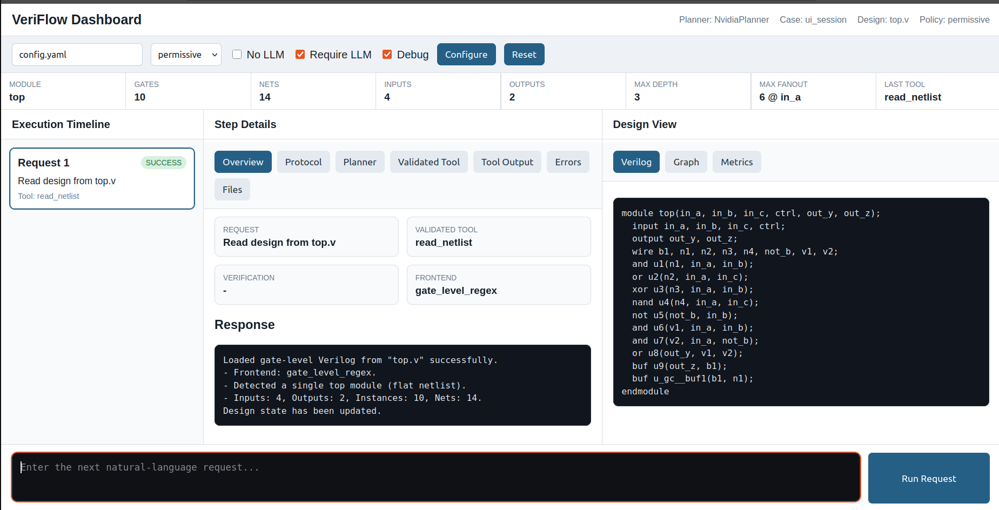
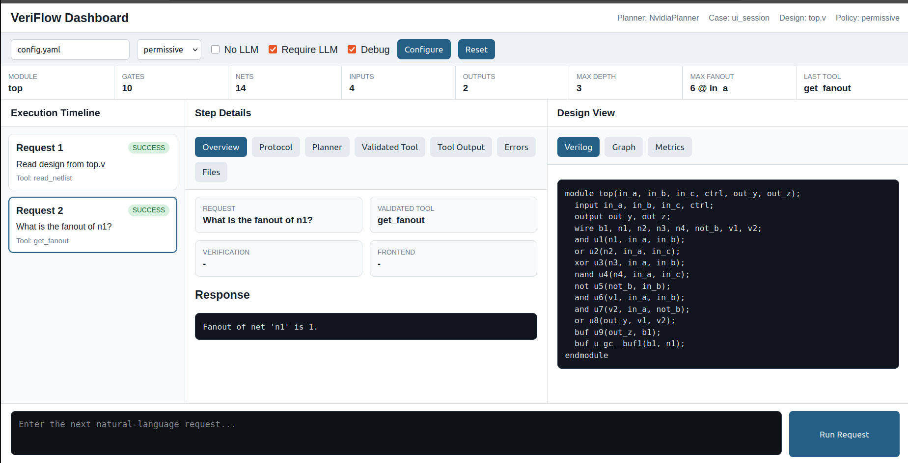
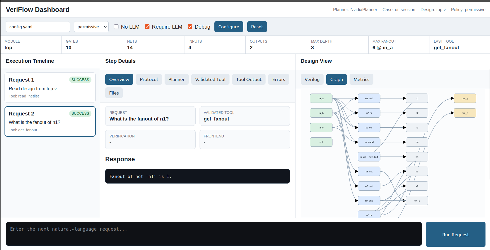

# VeriFlow: Verified Natural-Language EDA Automation

VeriFlow is a safety-focused EDA automation framework for gate-level Verilog analysis and transformation. It lets an engineer issue natural-language requests, constrains planner output to validated JSON tool calls, executes those tools through a deterministic backend, and verifies design-changing operations with Yosys/ABC where available.


```text
natural language request
        -> planner
        -> strict JSON tool call
        -> schema validator
        -> deterministic EDA engine
        -> Verilog/Yosys/ABC backend
        -> protocol, logs, artifacts, and UI output
```

The core design principle is simple:

**LLMs may plan, but deterministic tools must execute and verify.**





---

## Why This Project Exists

LLMs are useful for interpreting ambiguous engineering requests, but they should not directly edit RTL, run arbitrary shell commands, or silently produce unverified netlist changes. VeriFlow separates those responsibilities:

- the planner converts an engineer's request into a constrained JSON tool call
- the validator rejects unsupported or unsafe tool calls
- the engine performs deterministic netlist analysis and transformations
- Yosys and ABC provide normalization, optimization, and equivalence-checking support
- logs and artifacts make each decision inspectable

This makes the project a practical prototype for safe AI-assisted EDA workflows.

---

## Current Capabilities

- Natural-language command handling for netlist analysis and transformations
- Strict JSON schema validation for all planner output
- Deterministic fallback planner for offline use without an LLM
- NVIDIA Nemotron planner adapter for LLM-assisted planning
- Gemini planner adapter retained as an alternate development option
- Hybrid Verilog frontend: a name-preserving gate-level parser with Yosys JSON fallback for richer Verilog
- Internal netlist IR for graph-style analysis
- Yosys integration for normalization and BLIF export
- ABC integration for optimization and equivalence checking
- Configurable verification policy for transformations: `strict`, `permissive`, or `dry_run`
- Automatic verification and rollback paths for transformations where supported
- Contest-style `#RESPONSE <id>` / `#END <id>` protocol compatibility
- Structured debug artifacts under `results/`
- FastAPI development UI for inspecting requests, tool calls, outputs, and generated Verilog
- Benchmark runner for collecting frontend, gate-count, depth, fanout, and load-time metrics across sample designs
- Pytest coverage for protocol, schema validation, config handling, engine behavior, external-tool wrappers, and app smoke tests

---

## Repository Structure

- `src/app.py` - stdin-driven application shell and top-level request handling
- `src/protocol.py` - response protocol manager and testcase logging
- `src/schema.py` - tool names, strict JSON schema, and validator
- `src/ir.py` - internal netlist graph representation
- `src/parser.py` - gate-level Verilog parser/writer and Yosys JSON-to-IR adapter
- `src/engine.py` - deterministic backend EDA executor
- `src/backends/`
  - `python_graph.py` - lightweight NetlistIR graph analysis
  - `yosys_backend.py` - Yosys frontend, normalization, cleanup, and export operations
  - `equivalence.py` - ABC-backed equivalence checking facade
  - `router.py` - operation-to-backend ownership map
- `src/planners/`
  - `base.py` - planner interface
  - `heuristic.py` - deterministic fallback planner
  - `gemini.py` - Gemini JSON-planner adapter
  - `nvidia.py` - NVIDIA NIM/Nemotron JSON-planner adapter
- `src/config.py` - config loader and planner factory
- `src/external_tools.py` - bounded wrappers for Yosys and ABC
- `ui_server.py` - development UI server for inspecting requests, tool calls, and artifacts
- `ui/` - static files for the browser UI
- `benchmarks/` - sample Verilog designs and generated benchmark reports
- `scripts/benchmark.py` - benchmark runner for IR/frontend metrics
- `tests/` - pytest coverage for the current backend and app behavior
- `VERIFICATION_REPORT.md` - current verification notes and tested flows
- `TEST_DESIGNS.md` - documentation for included test circuits

---

## Setup

```bash
python3 -m venv .venv
source .venv/bin/activate
pip install -r requirements.txt
```

Yosys and ABC are optional for basic development, but recommended for the full verification flow.

---

## Run Tests

```bash
make test
```

Use this as the first validation step after cloning or modifying the project.

---

## Run Without An LLM

```bash
python src/app.py --no-llm
```

This uses the deterministic heuristic planner only.

---

## Run With NVIDIA Nemotron

Create `config.yaml`:

```yaml
provider: "nvidia"

nvidia:
  api_key: ""  # leave blank to use NVIDIA_API_KEY
  base_url: "https://integrate.api.nvidia.com/v1"
  model: "nvidia/nemotron-3-super-120b-a12b"
  timeout_sec: 25

generation:
  temperature: 0.0
  max_output_tokens: 1024

verification_policy: "permissive"
```

Set your API key with a local `.env` file:

```bash
cp .env.example .env
# edit .env and set NVIDIA_API_KEY
```

`.env` is ignored by git and loaded automatically by the app. A shell environment variable still takes precedence if both are set.

Then run:

```bash
python src/app.py -config config.yaml
```

Useful flags:

```bash
python src/app.py -config config.yaml --debug
python src/app.py -config config.yaml --require-llm
python src/app.py -config config.yaml --verification-policy strict
python src/app.py --no-llm
```

### Planner Behavior

- If NVIDIA is configured and available, the app uses the Nemotron planner through NVIDIA's OpenAI-compatible NIM API.
- If NVIDIA is unavailable, missing credentials, or returns invalid output, the app falls back to the heuristic planner unless `--require-llm` is used.
- Nemotron is used only as a planner that emits strict JSON tool calls.
- Nemotron does not directly edit Verilog or execute shell commands.
- Gemini is still available by setting `provider: "gemini"` and configuring the `gemini:` block.

---

## Example Session

```text
This is the beginning of testcase case1. Please output a copy of the log into case1.log.
Read in design from top.v.
What is the fanout of n1?
Write out the current design to out.v.
```

The beginning-of-testcase line initializes protocol/log state and becomes response 1.

---

## Supported Tool Calls

- `read_netlist` - load a gate-level Verilog netlist
- `write_netlist` - write the current design to a Verilog file
- `get_fanout` - get fanout count for a node or net
- `get_max_depth` - get maximum logic depth between two points
- `find_path` - find a signal path between source and sink
- `remove_dangling_logic` - remove unused logic and nets
- `clean_dangling_and_write` - read an input design, remove dangling logic, and write a cleaned output design
- `check_external_tools` - check availability of Yosys/ABC tools
- `normalize_design` - normalize the design using Yosys
- `check_equivalence` - verify design equivalence using ABC miter flow
- `check_max_fanout` - check whether the design violates a fanout constraint
- `insert_and_before_buffers` - insert AND gates before selected buffer instances
- `replace_gates` - replace selected gate types
- `optimize_cone` - optimize a logic cone with depth/gate constraints

Design-changing tools are structured around verification-first execution: store a reference design, apply the transformation, normalize if needed, check equivalence when possible, and reject or roll back unsafe results.

---

## External Tool Integration

VeriFlow uses standard open-source EDA tools behind bounded backend wrappers:

- **Yosys** - Verilog parsing, hierarchy checks, normalization, cleanup, and BLIF export
- **ABC** - combinational optimization, rewrite/balance passes, and equivalence checking

The planner never sees raw shell tools. It emits high-level tool calls, and the deterministic engine decides when to use Python IR logic, Yosys, or ABC.

### Backend Routing

VeriFlow is intentionally an orchestration layer, not a replacement for mature EDA engines. The backend router assigns operations to the right execution backend:

- **Python graph backend** - cheap deterministic queries such as fanout, path search, max depth, cone discovery, and metrics
- **Yosys backend** - Verilog frontend fallback, normalization, cleanup, BLIF export, and unused-logic removal
- **ABC equivalence backend** - miter/prove checks over BLIF generated by Yosys
- **Python structural edits** - small controlled edits such as inserting gates or replacing selected primitives, followed by Yosys normalization and equivalence policy checks

This keeps the project focused on safe planning, orchestration, reporting, rollback, and UX while delegating serious EDA algorithms to proven tools.

---

## Development UI

The repository includes a FastAPI-based UI server for inspecting the flow:

```bash
make run-ui
```

The UI is useful for:

- sending one request at a time to the backend
- viewing the planner output and validated tool call
- inspecting execution summaries and structured data
- viewing the current generated Verilog
- browsing artifacts from `results/`

---

## Benchmarks

Run the benchmark suite from the project root:

```bash
make benchmark
```

The runner loads every Verilog design under `benchmarks/designs/` through the same engine used by the app and writes:

- `benchmarks/results/summary.json` - structured metrics
- `benchmarks/results/summary.md` - Markdown table for demos and reports

Current metrics include frontend used, load time, inputs, outputs, gate instances, nets, maximum logic depth, maximum fanout, and fanout-constraint status.

---

## Debug Artifacts

During development, the app writes intermediate artifacts under `results/`, including:

- latest user request
- raw planner output
- planner metadata
- validated tool JSON
- tool execution summary
- structured tool output data
- final response text
- validation or execution errors

These files make it easier to debug planner behavior and audit how a natural-language request became a deterministic EDA operation.

---

## Verification Approach

The project is designed around a verification-first flow:

```text
request
  -> validated operation
  -> reference design snapshot
  -> deterministic transformation
  -> Yosys normalization/export
  -> ABC equivalence check
  -> commit or reject
```

Today, equivalence checking is implemented through the open-source EDA stack:

1. The reference design and current design are written as temporary Verilog files.
2. Yosys converts both designs to BLIF.
3. ABC builds a miter and runs `prove`.
4. VeriFlow interprets the result as proved, failed, or inconclusive.

This means the current checker is structural/Boolean equivalence through Yosys + ABC, not the separate `Verilog-Equivalence-Checking` project. That project would be a strong next backend to integrate behind the same `check_equivalence` API, especially if it provides clearer counterexamples, better Verilog subset support, or a pure-Python fallback when ABC is unavailable.

Verification policy controls whether a transformation is committed:

- `strict` - commit only when equivalence is explicitly proved
- `permissive` - commit when equivalence is proved or inconclusive, but reject known failures
- `dry_run` - analyze the transformation and verification result, then roll back without committing

Current tests cover protocol handling, schema validation, config fallback behavior, engine operations, external-tool wrappers, and end-to-end app smoke flows. See `VERIFICATION_REPORT.md` and `TEST_DESIGNS.md` for the current verification notes and test circuits.

---

## Current Limitations

The project is an active prototype. The main limitations are:

- The primary gate-level parser is intentionally restricted; richer Verilog is handled through the Yosys JSON fallback where possible.
- The Yosys JSON adapter currently targets the project's one-bit gate-level IR; full SystemVerilog, hierarchy, wide buses, and complex sequential designs need broader lowering support.
- Benchmarks are currently small representative circuits; larger industrial-style suites should be added over time.
- Equivalence checking currently depends on local Yosys/ABC availability unless another checker backend is added.
- The UI is currently a development dashboard, not a polished production interface.

---

## Roadmap

The most important next improvements are:

1. Extend the Yosys JSON frontend to support wider buses, hierarchy flattening policies, richer sequential cells, and alias-preserving net metadata.
2. Add a benchmark suite with gate-count, depth, fanout, runtime, and equivalence metrics.
3. Add a pluggable equivalence backend interface so Yosys/ABC and the standalone Verilog equivalence checker can be selected by config.
4. Upgrade the UI into a netlist transformation dashboard with graph visualization and before/after diffs.
5. Add REST endpoints for loading designs, submitting commands, querying metrics, and exporting reports.
6. Add CI that runs tests, linting, and sample transformations.
7. Package the full environment with Docker or a devcontainer, including Yosys and ABC.

---

## Project Positioning

VeriFlow demonstrates a practical architecture for AI-assisted hardware design automation:

- LLM-safe tool calling
- deterministic EDA execution
- gate-level Verilog analysis
- formal-equivalence-oriented verification
- inspectable logs and artifacts
- extensible backend wrappers for industry-standard EDA tools

The project is suitable for showcasing work at the intersection of EDA, digital design automation, Python backend systems, and safe AI tooling.
